## Preliminaries
Bar charts are useful for displaying count data but are often used to portray statistical information that they don't represent well. In this lesson we'll learn to ['Kick the bar chart habit'](http://www.nature.com/nmeth/journal/v11/n2/full/nmeth.2837.html) by creating box plots as an alternative to bar charts. This lesson uses data from a multi-system survey of mouse physiology in 8 inbred founder strains and 54 F1 hybrids of the Collaborative Cross. The study is described in [Lenarcic et al, 2012](http://www.genetics.org/content/190/2/413.full). For more information about this data set, see the [CGDpheno3 data](http://phenome.jax.org/projects/CGDpheno3) at Mouse Phenome Database. 

#### Load package and library
Load the ggplot library. You'll need to install the packages
first if you haven't done so already. Install them from the `Packages` tab in RStudio, or use the `install.packages()` command in the Console. Use double quotes around the package name.

~~~
install.packages("ggplot2")
~~~
{: .r}

You only need to install a package once to download it into your machine's library. Once you have installed the package on your machine, you need to load the library into R in order to use the functions contained in the package.  

~~~
library(ggplot2)
~~~
{: .r}

#### Load and explore data
Load the data from this shortened URL. Mind the double quotes.  

~~~
cc_data <- read.csv(file = "http://bit.ly/CGDPheno3")
~~~
{: .r}

Explore the data variables. The first 4 columns contain strain, sex, and ID numbers. The remaining contain phenotype measurements with abbreviated names.

~~~
names(cc_data)
~~~
{: .r}

~~~
 [1] "strain"          "sex"             "id"             
 [4] "mouse_num"       "CHOL"            "HDL"            
 [7] "GLU"             "TG"              "WBC"            
[10] "pctLYMP"         "pctNEUT"         "pctMONO"        
[13] "pctBASO"         "pctEOS"          "pctLUC"         
[16] "RBC"             "pctRetic"        "RDW"            
[19] "MCH"             "MCHC"            "CHCM"           
[22] "HDW"             "MCV"             "cHGB"           
[25] "mHGB"            "HCT"             "PLT"            
[28] "MPV"             "pulse"           "pulse_std"      
[31] "systolic_BP"     "systolic_BP_std" "CV"             
[34] "HR"              "HRV"             "R_amplitude"    
[37] "RS_amplitude"    "N"               "PQ"             
[40] "PR"              "QRS"             "QT"             
[43] "QT_dispersion"   "QTc"             "QTc_dispersion" 
[46] "RR"              "ST"              "BMC"            
[49] "BMD"             "bone_area"       "total_area"     
[52] "LTM"             "pct_fat"         "TTM"            
[55] "bw"             
~~~
{: .output}

How many mice? 

~~~
dim(cc_data)
~~~
{: .r}

~~~
[1] 642  55
~~~
{: .output}

There are 642 mice in rows, and 55 columns containing strain, sex, ID numbers, and phenotypes.

How many mice of each sex? 

~~~
table(cc_data$sex)
~~~
{: .r}

~~~

  f   m 
321 321 
~~~
{: .output}

How many mice of each strain? 

~~~
table(cc_data$strain)
~~~
{: .r}

~~~

129S1/SvImJ     129SAF1    129SB6F1  129SCASTF1   129SNODF1   129SNZOF1 
         10          10          10          10           5          21 
  129SPWKF1   129SWSBF1         A/J     A129SF1       AB6F1     ACASTF1 
         10          10          10          10          10          10 
     ANODF1      ANZOF1      APWKF1      AWSBF1  B6129SF1/J     B6AF1/J 
         10          10          10          10          10          10 
   B6CASTF1     B6NODF1     B6NZOF1     B6PWKF1     B6WSBF1    C57BL/6J 
         10          10          10          11          10          10 
   CAST/EiJ  CAST129SF1     CASTAF1    CASTB6F1   CASTNODF1   CASTNZOF1 
         11          10          10          10          10          10 
  CASTPWKF1   CASTWSBF1  NOD/ShiLtJ   NOD129SF1      NODAF1     NODB6F1 
         10          10          10          10          10          10 
  NODCASTF1    NODNZOF1    NODPWKF1    NODWSBF1   NZO/HlLtJ   NZO129SF1 
         10          10          12          10          10          10 
     NZOAF1     NZOB6F1    NZONODF1    NZOWSBF1     PWK/PhJ   PWK129SF1 
          9          10          10          10          10          12 
     PWKAF1     PWKB6F1   PWKCASTF1    PWKNODF1    PWKNZOF1    PWKWSBF1 
         10          10          10          10          10          10 
    WSB/EiJ   WSB129SF1      WSBAF1     WSBB6F1   WSBCASTF1    WSBNODF1 
         17          10          10          10          11          13 
   WSBNZOF1    WSBPWKF1 
         10          10 
~~~
{: .output}

In most cases there are 10 mice of each strain, with some exceptions. Some strains have only 5 mice, while others have as many as 21.  
How many mice of each strain by sex?

~~~
table(cc_data$sex, cc_data$strain)
~~~
{: .r}

~~~
   
    129S1/SvImJ 129SAF1 129SB6F1 129SCASTF1 129SNODF1 129SNZOF1 129SPWKF1
  f           5       5        5          5         5         7         5
  m           5       5        5          5         0        14         5
   
    129SWSBF1 A/J A129SF1 AB6F1 ACASTF1 ANODF1 ANZOF1 APWKF1 AWSBF1
  f         5   5       5     5       5      5      5      5      5
  m         5   5       5     5       5      5      5      5      5
   
    B6129SF1/J B6AF1/J B6CASTF1 B6NODF1 B6NZOF1 B6PWKF1 B6WSBF1 C57BL/6J
  f          5       5        5       5       5       6       5        5
  m          5       5        5       5       5       5       5        5
   
    CAST/EiJ CAST129SF1 CASTAF1 CASTB6F1 CASTNODF1 CASTNZOF1 CASTPWKF1
  f        5          5       5        5         5         5         5
  m        6          5       5        5         5         5         5
   
    CASTWSBF1 NOD/ShiLtJ NOD129SF1 NODAF1 NODB6F1 NODCASTF1 NODNZOF1
  f         5          5         5      5       5         5        5
  m         5          5         5      5       5         5        5
   
    NODPWKF1 NODWSBF1 NZO/HlLtJ NZO129SF1 NZOAF1 NZOB6F1 NZONODF1 NZOWSBF1
  f        7        5         5         5      4       5        5        5
  m        5        5         5         5      5       5        5        5
   
    PWK/PhJ PWK129SF1 PWKAF1 PWKB6F1 PWKCASTF1 PWKNODF1 PWKNZOF1 PWKWSBF1
  f       5         7      5       5         5        5        5        5
  m       5         5      5       5         5        5        5        5
   
    WSB/EiJ WSB129SF1 WSBAF1 WSBB6F1 WSBCASTF1 WSBNODF1 WSBNZOF1 WSBPWKF1
  f       7         5      5       5         6        7        5        5
  m      10         5      5       5         5        6        5        5
~~~
{: .output}

Most strains have 5 mice of each sex, while some may have 0 or as many as 14 of one sex. How do the first few rows of data look? Note the NAs in the data. These are missing values and can complicate analyses unless specifically addressed. 

~~~
head(cc_data)
~~~
{: .r}

~~~
       strain sex      id mouse_num CHOL   HDL GLU TG   WBC pctLYMP
1 129S1/SvImJ   f CCF1F01     92297  100  86.8 140 86 11.17    84.4
2 129S1/SvImJ   f CCF1F02     92298  104  94.3 143 56 12.84    81.4
3 129S1/SvImJ   f CCF1F03     92299  111  86.7 126 80  9.67    78.2
4 129S1/SvImJ   f CCF1F04     92300  107  92.6 161 80  9.84    90.4
5 129S1/SvImJ   f CCF1F05     92301  115  97.7 155 84 10.29    89.3
6 129S1/SvImJ   m CCF1M01     92302  137 122.9 167 90  8.90    85.1
  pctNEUT pctMONO pctBASO pctEOS pctLUC   RBC pctRetic  RDW  MCH MCHC CHCM
1    11.1     0.7     0.3    3.0    0.6  9.89      2.7 15.1 16.2 33.8 31.9
2    15.2     1.4     0.3    1.1    0.6 10.43      2.5 14.5 15.8 33.2 31.8
3    17.5     1.5     0.3    1.9    0.6  9.79      4.1 16.4 15.7 33.2 31.8
4     5.9     1.2     0.1    1.8    0.4 10.22      3.4 15.0 15.9 33.0 31.4
5     6.0     1.2     0.2    2.8    0.4 10.70      2.4 14.2 15.9 33.4 31.8
6    10.7     1.3     0.2    2.1    0.6 10.51      2.9 13.8 15.6 32.7 31.3
   HDW  MCV cHGB mHGB  HCT PLT MPV pulse pulse_std systolic_BP
1 1.88 47.8 15.1 16.0 47.3 771 6.8    NA        NA          NA
2 1.95 47.6 15.8 16.5 49.7 643 8.5    NA        NA          NA
3 2.10 47.4 14.8 15.4 46.4 762 7.5    NA        NA          NA
4 1.97 48.1 15.4 16.2 49.2 923 8.3    NA        NA          NA
5 1.98 47.8 16.3 17.1 51.1 783 8.3    NA        NA          NA
6 1.77 47.5 15.7 16.4 50.0 791 7.8    NA        NA          NA
  systolic_BP_std CV HR HRV R_amplitude RS_amplitude  N PQ PR QRS QT
1              NA NA NA  NA          NA           NA NA NA NA  NA NA
2              NA NA NA  NA          NA           NA NA NA NA  NA NA
3              NA NA NA  NA          NA           NA NA NA NA  NA NA
4              NA NA NA  NA          NA           NA NA NA NA  NA NA
5              NA NA NA  NA          NA           NA NA NA NA  NA NA
6              NA NA NA  NA          NA           NA NA NA NA  NA NA
  QT_dispersion QTc QTc_dispersion RR ST  BMC  BMD bone_area total_area
1            NA  NA             NA NA NA 0.31 0.07      5.84       9.92
2            NA  NA             NA NA NA 0.26 0.07      4.83       9.77
3            NA  NA             NA NA NA 0.27 0.07      4.90       9.77
4            NA  NA             NA NA NA 0.25 0.06      4.89      10.95
5            NA  NA             NA NA NA 0.26 0.07      4.93      10.83
6            NA  NA             NA NA NA 0.27 0.06      5.12      11.63
   LTM pct_fat   TTM    bw
1 8.00   13.91  9.71 21.89
2 7.10   19.88  9.63 24.33
3 7.95   19.56 10.54 22.25
4 7.65   23.81 10.50 22.57
5 7.45   22.98 10.44 23.07
6 9.20   21.93 12.41 27.44
~~~
{: .output}

## Plotting with [ggplot](http://ggplot2.org/)
Use the `ggplot()` function, which is found in the `ggplot2` library. The basic `ggplot()` syntax is: `ggplot(data, mapping) + layer()`. We will build a plot of red blood cells by strain in several steps, addressing many of the ways that you can fine-tune your plot to display exactly the information that you want in the way that you want to do so. 

~~~
ggplot(data = cc_data, mapping = aes(x = strain, y = RBC)) + 
  geom_boxplot()
~~~
{: .r}

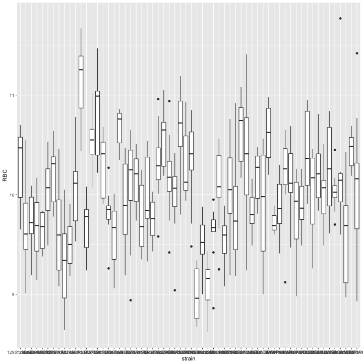

In a boxplot, the upper whisker extends to the highest value within 1.5 x inter-quartile range (IQR, or distance between first and third quartiles) and the lower whisker extends to the lowest value within 1.5 x IQR of the hinge. Data beyond the end of the whiskers (outliers) are plotted as points.

You can view summary statistical information about a phenotype, such as the first quartile, median, or third quartile values by using `summary()`.

~~~
summary(object = cc_data$RBC)
~~~
{: .r}

~~~
   Min. 1st Qu.  Median    Mean 3rd Qu.    Max.    NA's 
   8.62    9.68   10.03   10.03   10.40   11.77      16 
~~~
{: .output}

The median red blood cell count across all strains is 10.03 and the mean value is 10.0322524. You can view the distribution of red blood cell values with a histogram.

The histogram shows that the data are centered around the value of 10.03.  

If you wanted summary statistics for a specific strain, you could subset the data by specifying the strain name.

~~~
summary(cc_data$RBC[cc_data$strain=="NOD/ShiLtJ"])
~~~
{: .r}

~~~
   Min. 1st Qu.  Median    Mean 3rd Qu.    Max. 
  8.670   8.755   8.960   8.992   9.255   9.340 
~~~
{: .output}

We'll look at subsetting data more in a bit. Back to plotting.

It's difficult to distinguish the strain names on the x-axis, so flip the coordinates to place strain on the y-axis and red blood cells on the x-axis. 

~~~
ggplot(data = cc_data, mapping = aes(x = strain, y = RBC)) + 
  geom_boxplot() + 
  coord_flip()
~~~
{: .r}

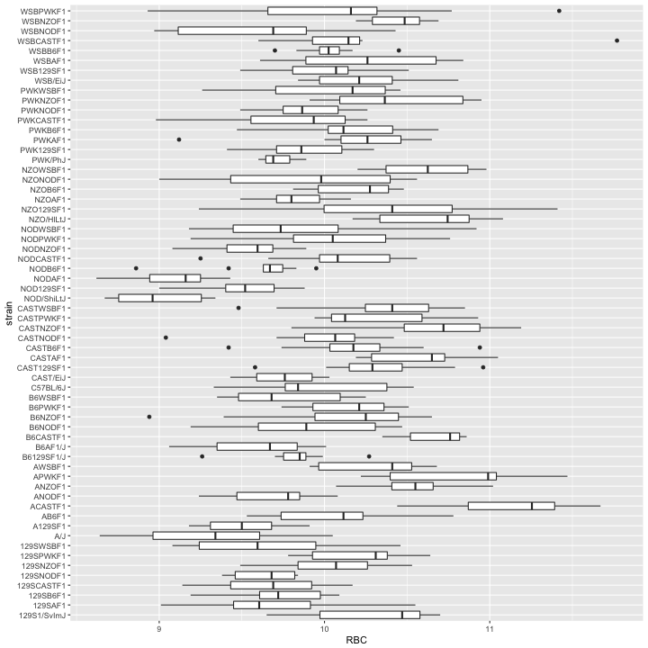

Are you using the up arrow on your keyboard to retrieve the last command you entered, or are you re-typing everything anew? Typing leads to pain and suffering (and typos), so use the up arrow to repeat your last command and then edit it. We don't believe in unnecessary pain or suffering.

Sort the strains by mean red blood cells. Do this by re-ordering strains within the mapping function `aes()`.

~~~
ggplot(data = cc_data, mapping = aes(x = reorder(strain, RBC, FUN = "mean", na.rm = TRUE), y = RBC)) + 
  geom_boxplot() + 
  coord_flip()
~~~
{: .r}

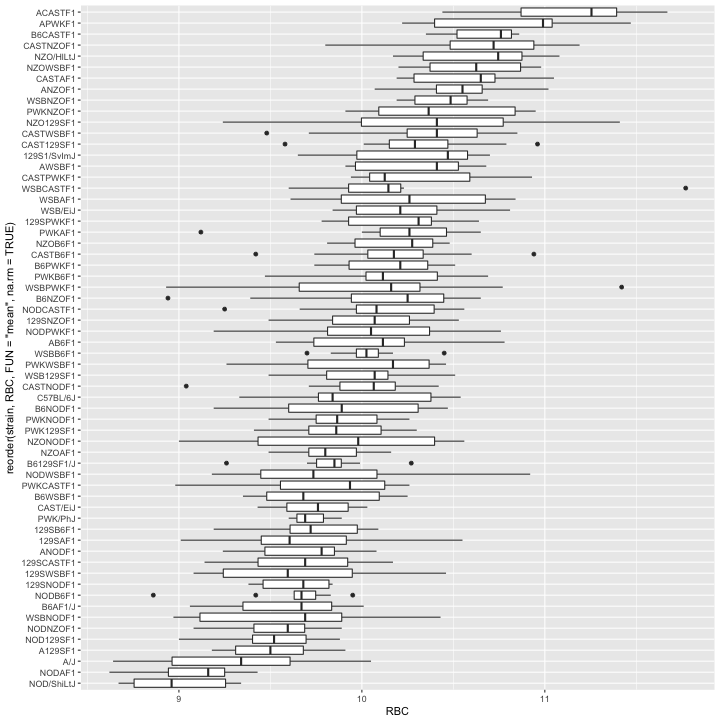

Add a point indicating the mean RBC value for each strain. Add a statistical summary layer to do this.

~~~
ggplot(data = cc_data, mapping = aes(x = reorder(strain, RBC, FUN = "mean", na.rm = TRUE), y = RBC)) + 
  geom_boxplot() + 
  coord_flip() + 
  stat_summary(fun.y = "mean", geom = "point")
~~~
{: .r}

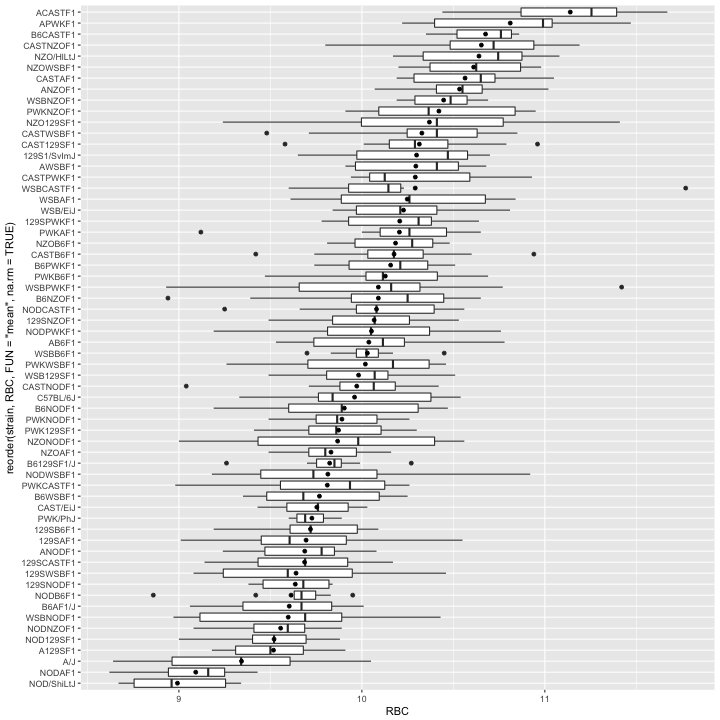

You should see an extra point indicating the mean red blood cell value for each strain. Is it the same as the median value for each strain, which is indicated by a vertical bar?  

Notice that the mean value is sensitive to outliers, while the median value is not sensitive to outliers.  

Find the boxplot for WSBCASTF1. Notice that a single data point with a value greater than 11.5 pulls the mean value for this strain far over to the right.

Plot the data points over each boxplot. Since ggplot builds a plot layer by layer, the boxplot layer should come before the data points so as not to obscure them.

~~~
ggplot(data = cc_data, mapping = aes(x = reorder(strain, RBC, FUN = "mean", na.rm = TRUE), y = RBC)) + 
  geom_boxplot() + 
  geom_point() +
  coord_flip() + 
  stat_summary(fun.y = "mean", geom = "point")
~~~
{: .r}

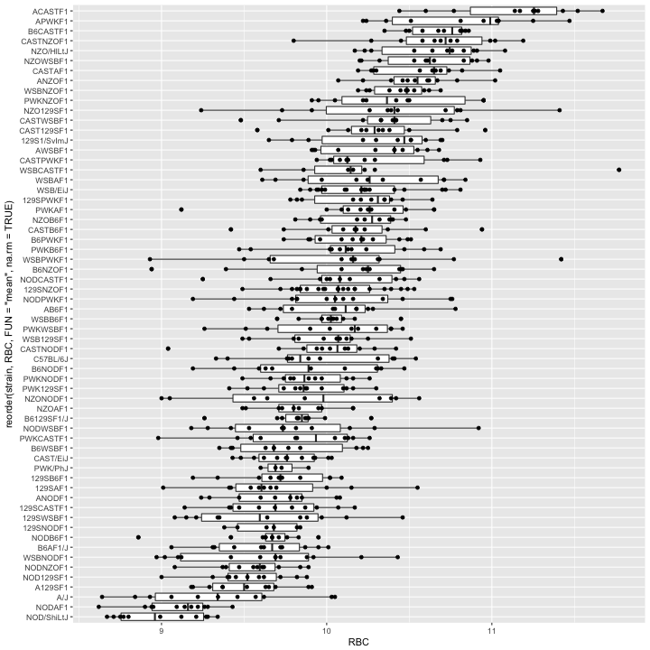

  Color the data points by sex. Save the plot as a variable. To view the plot, type the name of the variable.  

~~~
rbc_boxplot <- ggplot(data = cc_data, mapping = aes(x = reorder(strain, RBC, FUN = "mean", na.rm = TRUE),
                                                    y = RBC)) + 
  geom_boxplot() + 
  geom_point(aes(colour = sex)) +
  coord_flip() + 
  stat_summary(fun.y = "mean", geom = "point")
rbc_boxplot
~~~
{: .r}

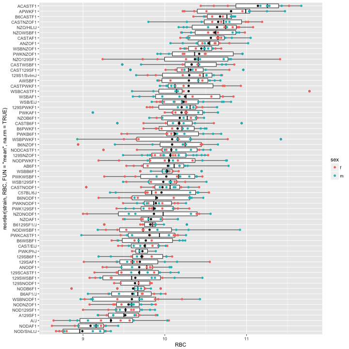

  Add axis labels. Redefine the plot variable.  

~~~
rbc_boxplot <- rbc_boxplot +
  xlab("strain") + 
  ylab("red blood cell count (n/uL)")
rbc_boxplot
~~~
{: .r}

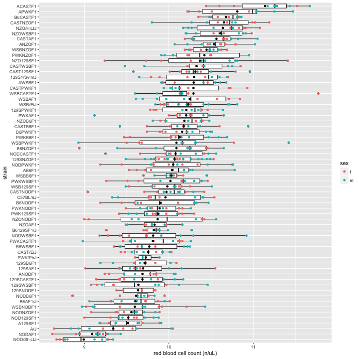

  Add a title. Redefine the plot variable.  

~~~
rbc_boxplot <- rbc_boxplot + 
  ggtitle("Red Blood Cell Distribution by Strain")
rbc_boxplot
~~~
{: .r}

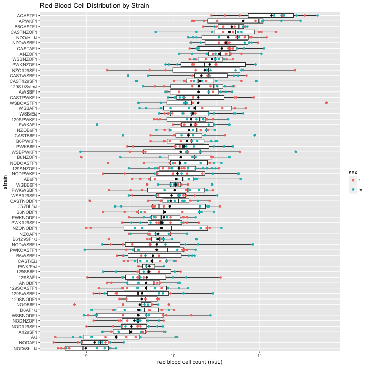

> ## Challenge 1
>
> 1. Choose another phenotype to plot as boxplots by strain.
> 2. Flip the coordinates if necessary to make strain names legible.
> 3. Order boxplots by mean phenotype value.
> 4. Add a point indicating the mean strain value. 
> 5. Add data points over the boxplots (optional). 
> 6. Add axis labels and a plot title.
>
> > ## Solution to Challenge 1
> > 1. For percent neutrophils: `ggplot(data = cc_data, mapping = aes(x = strain, y = pctNEUT)) + geom_boxplot()`
> > 2. For percent neutrophils: `ggplot(data = cc_data, mapping = aes(x = strain, y = pctNEUT)) + geom_boxplot() + coord_flip()`
> > 3. `ggplot(data = cc_data, mapping = aes(x = reorder(strain, pctNEUT, FUN = "mean", na.rm = TRUE), y = pctNEUT)) + geom_boxplot() + coord_flip()`
> > 4. `ggplot(data = cc_data, mapping = aes(x = reorder(strain, pctNEUT, FUN = "mean", na.rm = TRUE), y = pctNEUT)) + geom_boxplot() + coord_flip() + stat_summary(fun.y = "mean", geom = "point")`
> > 5. `ggplot(data = cc_data, mapping = aes(x = reorder(strain, pctNEUT, FUN = "mean", na.rm = TRUE), y = pctNEUT)) + geom_boxplot() + geom_point() + coord_flip() + stat_summary(fun.y = "mean", geom = "point")`
> > 6. `ggplot(data = cc_data, mapping = aes(x = reorder(strain, pctNEUT, FUN = "mean", na.rm = TRUE), y = pctNEUT)) + geom_boxplot() + geom_point() + coord_flip() + stat_summary(fun.y = "mean", geom = "point")  + xlab("strain") + ylab("percent neutrophils") + ggtitle("Percent Neutrophils by Strain")`
> {: .solution}
{: .challenge}  

> ## Challenge 2
>
> Compare the following plots. The first is a bar chart, the second a boxplot.
> 1. What information does the bar chart provide?
> 2. What information does the bar chart convey well?
> 3. What information does the bar chart fail to convey well?
> 4. What information does the boxplot provide?
> 5. What information does the boxplot convey well? 
> 6. What information does the boxplot fail to convey well?
> 
> ~~~
> Error in summarySE(cc_data_subset, "RBC", "strain", na.rm = TRUE): could not find function "summarySE"
> ~~~
> {: .error}
> 
> 
> 
> ~~~
> Error in ggplot(subset_se, aes(x = strain, y = RBC)): object 'subset_se' not found
> ~~~
> {: .error}
> 
> 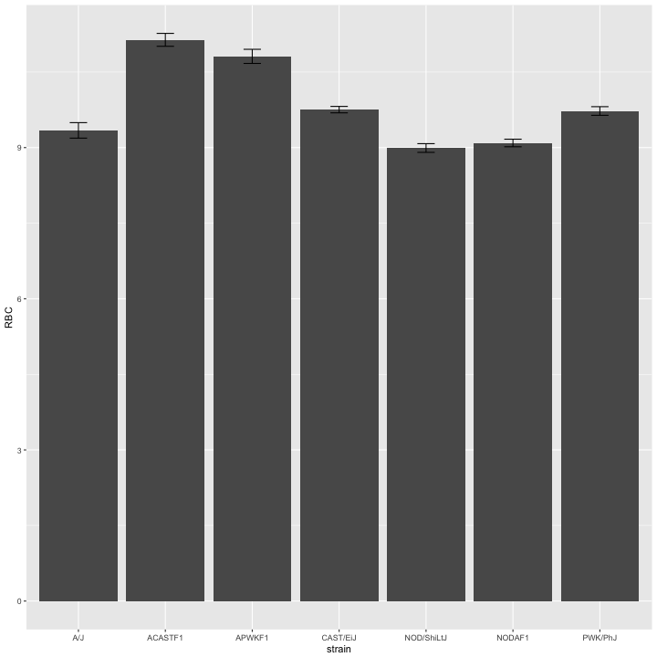
>
> > ## Solution to Challenge 2
> > 1. What information does the bar chart provide?
> > 2. What information does the bar chart convey well?
> > 3. What information does the bar chart fail to convey well?
> > 4. What information does the boxplot provide?
> > 5. What information does the boxplot convey well? 
> > 6. What information does the boxplot fail to convey well?
> {: .solution}
{: .challenge}

#### Subsetting data
Select a subset of the strains. Choose strains with the highest and lowest mean and median red blood cell counts. Include the parental strains of the F1s.  

~~~
cc_data_subset <- subset(cc_data, strain %in% c("ACASTF1", "APWKF1", "CAST/EiJ", "PWK/PhJ",
                                      "A/J", "NODAF1", "NOD/ShiLtJ") == TRUE)
~~~
{: .r}

  Create boxplots from the subset.  

~~~
ggplot(data = cc_data_subset, mapping = aes(x = strain, y = RBC)) + 
  geom_boxplot()
~~~
{: .r}

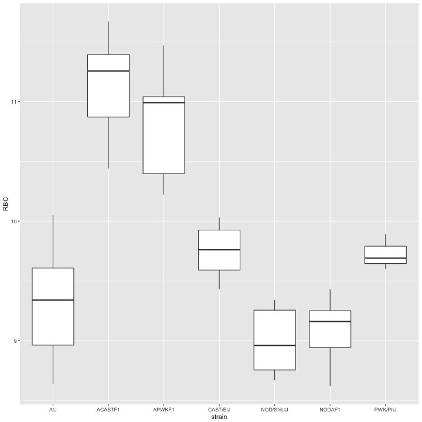

Order by mean RBC value as before. Save the plot as a variable.

~~~
subset_boxplot <- ggplot(data = cc_data_subset,
                         mapping = aes(x = reorder(strain, RBC, FUN = "mean", na.rm = TRUE),
                                       y = RBC)) + 
  geom_boxplot()
subset_boxplot
~~~
{: .r}

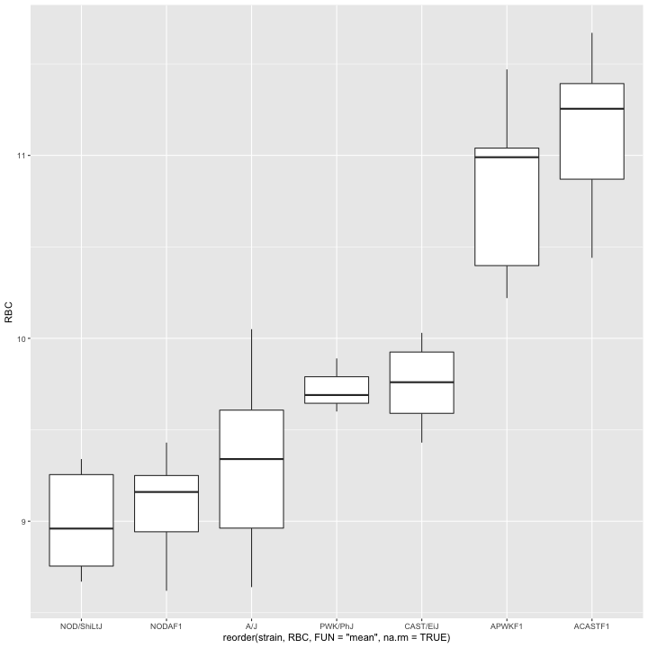

This time there's no need to flip the axes since the strain names are legible on the x-axis. 
Plot the data points by sex.The boxplots have already been drawn and saved in the variable `subset_boxplot`. Layer the data points on top of the boxplots and color them by sex.

~~~
subset_boxplot <- subset_boxplot + 
  geom_point(aes(colour = sex))
subset_boxplot
~~~
{: .r}

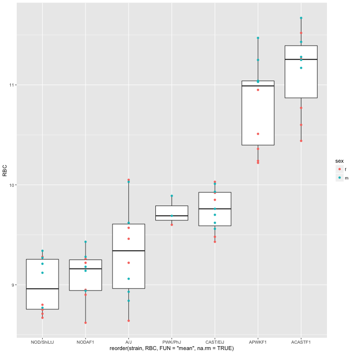

Add a purple square indicating the mean RBC value for each strain.

~~~
subset_boxplot <- subset_boxplot + 
  stat_summary(fun.y = "mean", geom = "point", colour = "mediumpurple4", shape = 15, size = 2)
subset_boxplot
~~~
{: .r}

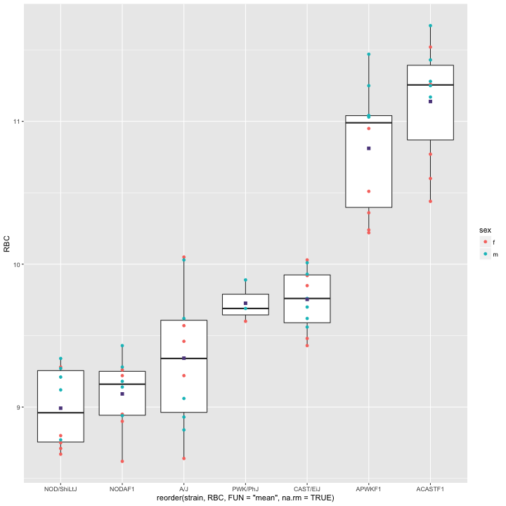

Add x and y axis labels.

~~~
subset_boxplot <- subset_boxplot + 
  xlab("strain") + 
  ylab("red blood cell count (n/uL)")
subset_boxplot
~~~
{: .r}

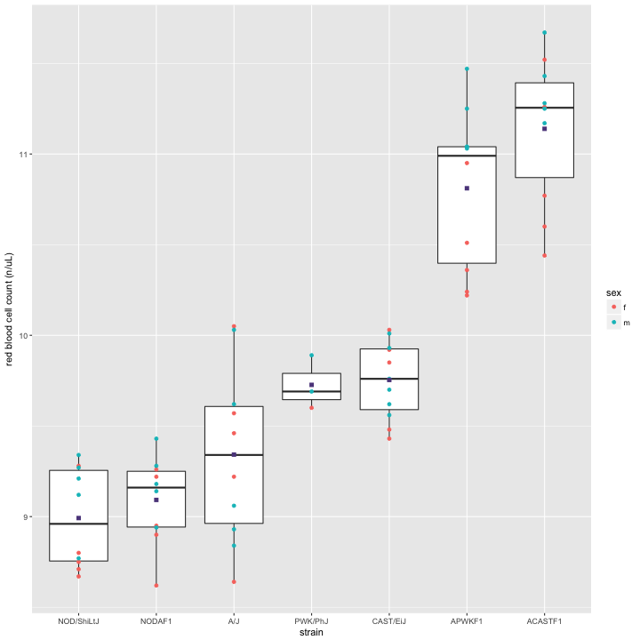

Add a title.

~~~
subset_boxplot <- subset_boxplot + 
  ggtitle("Red Blood Cell Distribution by Strain")
subset_boxplot
~~~
{: .r}

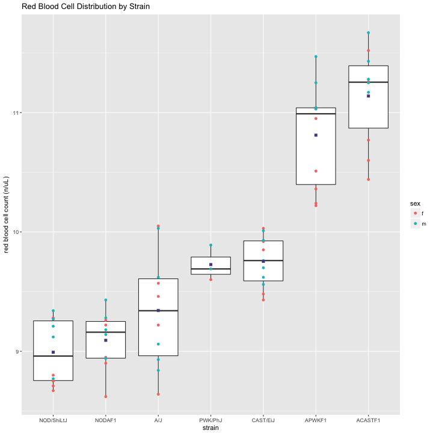

Output the plot to a PDF file. Set width and height. Turn off the output to pdf with the `dev.off()` command.

~~~
pdf("subset-boxplot.pdf", width= 8, height = 9)
print(subset_boxplot)
dev.off()
~~~
{: .r}

~~~
quartz_off_screen 
                2 
~~~
{: .output}

Picture a set of bar charts indicating the mean and s.e.m. for each strain. Which plot communicates more information, a bar chart or a box plot?

## References
1. Kick the bar chart habit. Nat Meth. 2014;11(2):113. doi: 10.1038/nmeth.2837. 
2. Lenarcic AB, Svenson KL, Churchill GA, Valdar W. A general Bayesian approach to analyzing diallel crosses of inbred strains. Genetics. 2012 Feb 1;190(2):413-35.
3. Spitzer M, Wildenhain J, Rappsilber J, Tyers M. BoxPlotR: a web tool for generation of box plots. Nat Meth. 2014;11(2):121-2. doi: 10.1038/nmeth.2811.
4. Krzywinski M, Altman N. Points of Significance: Visualizing samples with box plots. Nat Meth. 2014;11(2):119-20. doi: 10.1038/nmeth.2813.
