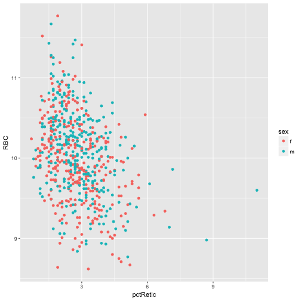
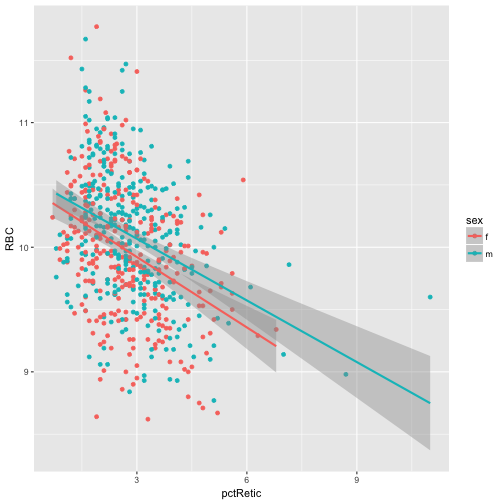

## Preliminaries
Scatterplots are simple ways to visualize data. We can explore the relationship between data variables by scatterplotting one against the other and by adding regression lines to the plots. We'll use baseline survey data for the 8 inbred Collaborative Cross founder strains and 54 F1 hybrids for this purpose. Measurements include blood, cardiovascular, bone, body size, weight, and composition. For more information about this data set, see the [CGDpheno3 data](http://phenome.jax.org/db/q?rtn=projects/details&id=439) at Mouse Phenome Database.

Load the ggplot library and the data.

~~~
library(ggplot2)
# try https:// if you get an error message when loading data from the URL.
cc_data <- read.csv(file = "http://bit.ly/CGDPheno3")
~~~
{: .r}

Let's look at the structure of the data. *str()* provides the data type for the 642 rows and 55 columns in the cc_data founder strain data. Animals are in rows and measurements in columns.

~~~
str(cc_data)
~~~
{: .r}

How many animals of each strain?

~~~
sort(table(cc_data$strain))
~~~
{: .r}

How many of each by sex?

~~~
table(cc_data$strain, cc_data$sex)
~~~
{: .r}

## A first scatterplot
Use `ggplot()` to create a scatterplot of red blood cells on the x axis by percent reticulocytes on the y. The basic `ggplot()` syntax is: `ggplot(data, mapping) + layer()`. The geometric object, or layer, used to define a scatterplot is `geom_point()`.

~~~
ggplot(data=cc_data, mapping = aes(x = pctRetic, y = RBC)) +
  geom_point()
~~~
{: .r}

## Linear regression
`geom_smooth()` is the "geom" (geometric object) used to add a smoother or regression line to a scatterplot. The default smoother is `loess`, which uses a smooth local regression. Specify a linear model instead.

~~~
ggplot(data=cc_data, mapping = aes(x = pctRetic, y = RBC)) +
  geom_point() +
  geom_smooth(method = "lm")
~~~
{: .r}

There appears to be a negative correlation between red blood cells and percent reticulocytes (immmature red blood cells). By default `geom_smooth()` adds a 95% confidence interval around the regression line. To remove this, include the argument `se = FALSE` in the call to `geom_smooth()`. Notice that at the extreme values uncertainty in the model increases.

What is the strength of the correlation between these two variables? Determine the correlation coefficient between the two. Add the argument `use = "complete.obs"` to ignore missing data values ("NAs").

~~~
cor(x=cc_data$RBC, y=cc_data$pctRetic, use = "complete.obs")
~~~
{: .r}

~~~
[1] -0.3706628
~~~
{: .output}

As a rule of thumb, a Pearson correlation coefficient value between 0.3 and 0.5 (or -0.3 and -0.5) is considered weak, but shouldn't be overlooked.

Let's explore other ways to find relationships between the data variables. You can map color to the sex of the animal with the mapping function `aes()`.

~~~
ggplot(data=cc_data, mapping = aes(x = pctRetic, y = RBC)) +
  geom_point(aes(color = sex))
~~~
{: .r}

Notice that males have the most extreme values for percent reticulocytes. Now add a separate smoother for males and females. Do this by mapping color to sex in the initial call to `ggplot()`. If you map color to sex in the initial call to `ggplot()`, every layer that follows will inherit this mapping of color to sex. Notice that both the points and the regression lines are colored by sex.

~~~
ggplot(data=cc_data, mapping = aes(x = pctRetic, y = RBC, color = sex)) +
  geom_point() +
  geom_smooth(method = "lm")
~~~
{: .r}

It doesn't appear that there's a big sex difference in the relationship between red blood cells and percent reticulocytes. If so, you would expect to see regression lines with very different slopes. The negative correlation between reticulocytes and red blood cells persists. The vertical separation between the regression lines for male and female might indicate a difference in mean red blood cells between the sexes, however.

If you want to know whether there's a significant difference in mean RBC values between the two sexes, you would perform a t-test.

~~~
t.test(x = cc_data[cc_data$sex == "f", "RBC"], y = cc_data[cc_data$sex == "m", "RBC"])
~~~
{: .r}

~~~

	Welch Two Sample t-test

data:  cc_data[cc_data$sex == "f", "RBC"] and cc_data[cc_data$sex == "m", "RBC"]
t = -2.9463, df = 622.68, p-value = 0.003336
alternative hypothesis: true difference in means is not equal to 0
95 percent confidence interval:
 -0.20936659 -0.04189601
sample estimates:
mean of x mean of y 
 9.969035 10.094667 
~~~
{: .output}

Use facets to view males and females in separate panels.

~~~
ggplot(data=cc_data, mapping = aes(x = pctRetic, y = RBC, color = sex)) +
  geom_point() +
  geom_smooth(method = "lm") + 
  facet_wrap(~ sex)
~~~
{: .r}

Add a title and label the axes.

~~~
ggplot(data=cc_data, mapping = aes(x = pctRetic, y = RBC, color = sex)) +
  geom_point() +
  geom_smooth(method = "lm") + 
  facet_wrap(~ sex) +
  xlab("percent reticulocytes") +
  ylab("red blood cell count (n/uL)") +
  ggtitle("Red Blood Cell Count by Percent Reticulocytes")
~~~
{: .r}

> ## Challenge 1
> 
> 1. Choose two measurements from cc_data to scatterplot with `ggplot()`.
> 2. Add a smoother with `geom_smooth()`.
> 3. Color the points and the lines by sex.
> 4. Use facets to view males and females in separate panels.
> 5. Add axis labels and a plot title.  
> 6. Determine the correlation coefficient between the two phenotypes with `cor()`.
> 7. Do a `t.test()` to determine whether or not there's a significant difference in means between the sexes.
>
> > ## Solution to Challenge 1
> > 1. 
> > 2.
> > 3. 
> > 4. 
> > 5.
> > 6.
> > 7.
> {: .solution}
{: .challenge}  

## View relationships between many variables with a matrix of scatterplots

You might want to explore relationships between many variables in your data more generally in order to find interesting correlations. You can create a matrix, or grid, of scatterplots to do this. Use the `pairs()` function to create a scatterplot matrix.

First find the variables that you would like to plot against one another. List the names of the variables.

~~~
names(cc_data)
~~~
{: .r}

~~~
 [1] "strain"          "sex"             "id"             
 [4] "mouse_num"       "CHOL"            "HDL"            
 [7] "GLU"             "TG"              "WBC"            
[10] "pctLYMP"         "pctNEUT"         "pctMONO"        
[13] "pctBASO"         "pctEOS"          "pctLUC"         
[16] "RBC"             "pctRetic"        "RDW"            
[19] "MCH"             "MCHC"            "CHCM"           
[22] "HDW"             "MCV"             "cHGB"           
[25] "mHGB"            "HCT"             "PLT"            
[28] "MPV"             "pulse"           "pulse_std"      
[31] "systolic_BP"     "systolic_BP_std" "CV"             
[34] "HR"              "HRV"             "R_amplitude"    
[37] "RS_amplitude"    "N"               "PQ"             
[40] "PR"              "QRS"             "QT"             
[43] "QT_dispersion"   "QTc"             "QTc_dispersion" 
[46] "RR"              "ST"              "BMC"            
[49] "BMD"             "bone_area"       "total_area"     
[52] "LTM"             "pct_fat"         "TTM"            
[55] "bw"             
~~~
{: .output}

You can refer to variables by the column number or by name. Here are a few examples using the `pairs()` function, which is not part of the ggplot2 package.

~~~
# specify columns 5-8
pairs(cc_data[,5:8])
~~~
{: .r}

~~~
# specify columns by name
pairs(cc_data[,c("LTM", "PLT", "WBC", "RBC")])
~~~
{: .r}

~~~
# specify columns by column index number
pairs(cc_data[,c(5, 8, 14, 15)])
~~~
{: .r}

To further explore correlations between data variables, copy and paste the `panel.cor` and `panel.hist` functions into the Console.

~~~
## put (absolute) correlations on the upper panels,
## with size proportional to the correlations.
panel.cor <- function(x, y, digits = 2, prefix = "", cex.cor, ...)
{
    usr <- par("usr"); on.exit(par(usr))
    par(usr = c(0, 1, 0, 1))
    r <- abs(cor(x, y, use = "complete.obs"))
    txt <- format(c(r, 0.123456789), digits = digits)[1]
    txt <- paste0(prefix, txt)
    if(missing(cex.cor)) cex.cor <- 0.8/strwidth(txt)
    text(0.5, 0.5, txt, cex = cex.cor * r)
}

## put histograms on the diagonal
panel.hist <- function(x, ...)
{
    usr <- par("usr"); on.exit(par(usr))
    par(usr = c(usr[1:2], 0, 1.5) )
    h <- hist(x, plot = FALSE)
    breaks <- h$breaks; nB <- length(breaks)
    y <- h$counts; y <- y/max(y)
    rect(breaks[-nB], 0, breaks[-1], y, col = "cyan", ...)
}
~~~
{: .r}

Now that you've defined the panel functions, use them with `pairs()` to create a scatterplot matrix with histograms on the diagonal and absolute correlation values in the upper panel.

~~~
pairs(cc_data[,5:8],
	upper.panel = panel.cor, diag.panel = panel.hist)
~~~
{: .r}

