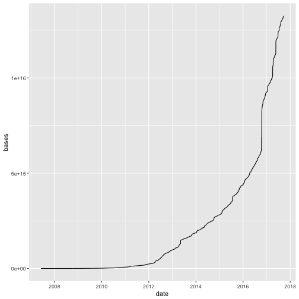
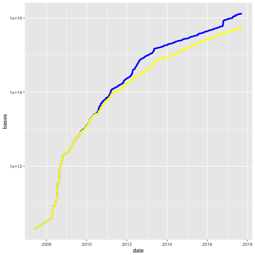

## Preliminaries
Time series plots are valuable but can be tricky to create because date and time formats in computing are not straightforward. Here we'll recreate the plot showing growth in the [Sequence Read Archive](http://www.ncbi.nlm.nih.gov/Traces/sra/) from 2008 to present.

## Load packages and libraries
Load the ggplot and scales libraries in order to use the functions contained in the packages.

~~~
library(ggplot2)
library(scales)
~~~
{: .r}

## Load data and explore
Read in the [Sequence Read Archive](https://trace.ncbi.nlm.nih.gov/Traces/sra/sra.cgi?) database growth file  and view structure.

~~~
sra <- read.csv("https://www.ncbi.nlm.nih.gov/Traces/sra/sra_stat.cgi")
str(sra)
~~~
{: .r}

~~~
'data.frame':	3177 obs. of  5 variables:
 $ date             : Factor w/ 3177 levels "01/01/2011","01/01/2012",..: 1338 790 798 833 887 906 914 923 942 961 ...
 $ bases            : num  2.03e+10 3.98e+10 4.14e+10 4.18e+10 4.19e+10 ...
 $ open_access_bases: num  2.03e+10 3.98e+10 4.14e+10 4.18e+10 4.19e+10 ...
 $ bytes            : num  5.05e+10 9.86e+10 1.03e+11 1.04e+11 1.04e+11 ...
 $ open_access_bytes: num  5.05e+10 9.86e+10 1.03e+11 1.04e+11 1.04e+11 ...
~~~
{: .output}

The data have 3177 rows and 5 columns. The first column is listed as a factor when in fact it is a date in the MM/DD/YYYY format. A factor is a categorical variable (i.e. red, green, blue, or low, middle, and high-income). Date variables are a data type that includes month, day and year, and that have their own specific functions to extract weekdays or count the number of days until an event, for example. To place dates on the x-axis in proper order, convert the first column to a date object in the YYYY-MM-DD format. First check to make sure that the first several dates will be converted correctly.

~~~
class(sra$date)
~~~
{: .r}

~~~
[1] "factor"
~~~
{: .output}

~~~
class(as.Date(sra$date, format = "%m/%d/%Y"))
~~~
{: .r}

~~~
[1] "Date"
~~~
{: .output}

~~~
head(sra$date)
~~~
{: .r}

~~~
[1] 06/05/2007 04/04/2008 04/05/2008 04/09/2008 04/15/2008 04/17/2008
3177 Levels: 01/01/2011 01/01/2012 01/01/2013 01/01/2014 ... 12/31/2016
~~~
{: .output}

~~~
head(as.Date(sra$date, format = "%m/%d/%Y"))
~~~
{: .r}

~~~
[1] "2007-06-05" "2008-04-04" "2008-04-05" "2008-04-09" "2008-04-15"
[6] "2008-04-17"
~~~
{: .output}

#### Convert date format
The first several dates convert correctly from MM/DD/YYYY to YYYY-MM-DD format, which is the default date format in R and the International Standards Organization (ISO) standard date format. Now convert all dates to the new format, and convert them from a factor variable to a date variable.

~~~
sra$date <- as.Date(sra$date, format = "%m/%d/%Y")
class(sra$date)
~~~
{: .r}

~~~
[1] "Date"
~~~
{: .output}

~~~
head(sra$date)
~~~
{: .r}

~~~
[1] "2007-06-05" "2008-04-04" "2008-04-05" "2008-04-09" "2008-04-15"
[6] "2008-04-17"
~~~
{: .output}

~~~
str(sra)
~~~
{: .r}

~~~
'data.frame':	3177 obs. of  5 variables:
 $ date             : Date, format: "2007-06-05" "2008-04-04" ...
 $ bases            : num  2.03e+10 3.98e+10 4.14e+10 4.18e+10 4.19e+10 ...
 $ open_access_bases: num  2.03e+10 3.98e+10 4.14e+10 4.18e+10 4.19e+10 ...
 $ bytes            : num  5.05e+10 9.86e+10 1.03e+11 1.04e+11 1.04e+11 ...
 $ open_access_bytes: num  5.05e+10 9.86e+10 1.03e+11 1.04e+11 1.04e+11 ...
~~~
{: .output}

## Plotting with [ggplot](http://ggplot2.org/)
Plot the number of bases and open access bases in SRA by layering lines over the time series on the x-axis. Use the ggplot() function, which is found in the ggplot2 library. Quick reminder of ggplot syntax: ggplot(data, mapping) + layer(). 
Start by plotting bases alone on the y-axis.

~~~
ggplot(data = sra, mapping = aes(x = date)) + 
  geom_line(aes(y = bases))
~~~
{: .r}

Can you identify the ggplot syntax in the code above? Remember: ggplot(data, mapping) + layer(). The layer is a line.
Now add a second layer, a line representing growth of open access bases. Use the up arrow on your keyboard to retrieve the last bit of code you wrote, and add onto that.

~~~
ggplot(data = sra, mapping = aes(x = date)) + 
  geom_line(aes(y = bases)) + 
  geom_line(aes(y = open_access_bases))
~~~
{: .r}

Change the line colors and sizes. Use the up arrow to retrieve the last code you ran, and add onto it rather than typing anew. More typing = more pain and suffering.

~~~
ggplot(data = sra, mapping = aes(x = date)) + 
  geom_line(aes(y = bases), colour = "blue", size = 1.5) + 
  geom_line(aes(y = open_access_bases), colour = "yellow", size = 1.5)
~~~
{: .r}

The plot seems to show zero bases until the year 2010. Check the smallest number of total bases and open access bases in the data. Are the minimum numbers of bases both zero?

~~~
min(sra$bases)
~~~
{: .r}

~~~
[1] 20304190150
~~~
{: .output}

~~~
min(sra$open_access_bases)
~~~
{: .r}

~~~
[1] 20304190150
~~~
{: .output}

~~~
max(sra$bases)
~~~
{: .r}

~~~
[1] 1.325317e+16
~~~
{: .output}

~~~
max(sra$open_access_bases)
~~~
{: .r}

~~~
[1] 5.457445e+15
~~~
{: .output}

#### Log-transform the y-axis
The smallest number of bases is 2.03e+10, and the largest number is 1.33e+16. The smallest number of open access bases is 2.03e+10, and the largest number is 5.46e+15. We need to transform the y axis to logarithmic for accurate display, so that the plot doesn't show values of zero that don't exist.

~~~
ggplot(data = sra, mapping = aes(x = date)) + 
  geom_line(aes(y = bases), colour = "blue", size = 1.5) + 
  geom_line(aes(y = open_access_bases), colour = "yellow", size = 1.5) +
  scale_y_log10()
~~~
{: .r}

#### Specify axis breaks and labels
Now manually define the y axis breaks so that each order of magnitude is represented.

~~~
ggplot(data = sra, mapping = aes(x = date)) + 
  geom_line(aes(y = bases), colour = "blue", size = 1.5) + 
  geom_line(aes(y = open_access_bases), colour = "yellow", size = 1.5) +
  scale_y_log10(breaks=c(1e+10, 1e+11, 1e+12, 1e+13, 1e+14, 1e+15))
~~~
{: .r}

Supply simpler superscripted exponents on the y axis labels. These are easier to read and interpret than are combinations of digits, plus signs, and the letter e.

~~~
ggplot(data = sra, mapping = aes(x = date)) + 
  geom_line(aes(y = bases), colour = "blue", size = 1.5) + 
  geom_line(aes(y = open_access_bases), colour = "yellow", size = 1.5) +
  scale_y_log10(breaks=c(1e+11, 1e+12, 1e+13, 1e+14, 1e+15, 1e+16),
                labels = expression("10"^"11", "10"^"12",
                                    "10"^"13", "10"^"14", "10"^"15", "10"^"16"))
~~~
{: .r}

Compare to the plot at the [Sequence Read Archive](http://www.ncbi.nlm.nih.gov/Traces/sra/).
Notice the difference in x and y axis labels and starting points. Our plot starts in the year 2000 with 2.03e+10 bases. The [Sequence Read Archive](http://www.ncbi.nlm.nih.gov/Traces/sra/) plot starts before the year 2009 with 10^12^ bases.

How many data points are there in each year?

~~~
table(format(sra$date, "%Y"))
~~~
{: .r}

~~~

2007 2008 2009 2010 2011 2012 2013 2014 2015 2016 2017 
   1  149  271  332  340  364  363  365  365  366  261 
~~~
{: .output}

Remove the single measurement in year 2007. This data point extend 
the line backward in time and give misleading information about the actual growth in the number of bases by making it appear as if data collection was consistent year-over-year. Start at year 2008, the first year of sustained data collection.

~~~
which(format(sra$date, "%Y") %in% c("2007"))
~~~
{: .r}

~~~
[1] 1
~~~
{: .output}

~~~
sra <- sra[-1,]
table(format(sra$date, "%Y"))
~~~
{: .r}

~~~

2008 2009 2010 2011 2012 2013 2014 2015 2016 2017 
 149  271  332  340  364  363  365  365  366  261 
~~~
{: .output}

Save the plot to a variable now that we've removed the 2007 data point. To view the plot, type the name of the variable.

~~~
logplot <- ggplot(data = sra, mapping = aes(x = date)) +
  geom_line(aes(y = bases), colour = "blue", size = 1.5) + 
  geom_line(aes(y = open_access_bases), colour = "yellow", size = 1.5) +
  scale_y_log10(breaks=c(1e+10, 1e+11, 1e+12, 1e+13, 1e+14, 1e+15),
                labels = expression("10"^"10", "10"^"11", "10"^"12", "10"^"13", "10"^"14",
                                    "10"^"15"))
logplot
~~~
{: .r}

Specify the breaks in the x-axis so that each year is shown. Redefine the variable
logplot with these changes.

~~~
logplot <- logplot + scale_x_date(labels = date_format("%Y"), breaks = date_breaks("years"))
logplot
~~~
{: .r}

#### Add text annotations, axis labels, and title
Add text annotations to the plot to label the lines for total and open access bases.

~~~
logplot <- logplot + 
  annotate("text", x=sra$date[1100], y=1.6e+15, label="total bases") + 
  annotate("text", x=sra$date[1700], y=1.25e+14, label="open access bases")
logplot
~~~
{: .r}

Add axis labels.

~~~
logplot <- logplot + 
  xlab("Year") + 
  ylab("Number of bases")
logplot
~~~
{: .r}

Add a title. Redefine logplot each time to save the changes.

~~~
logplot <- logplot + 
  ggtitle("Sequence Read Archive Database Growth")
logplot
~~~
{: .r}

#### Save the plot as a PDF file
Save the plot as a PDF using the `pdf()` command, or by using the Export button in the Plots tab. You can also save as a png(), jpeg(), tiff(), or bmp() using the corresponding command. If you choose to save as a file by running a command in the Console, provide a file name inside the parentheses surrounded by double quotes. Be sure to turn the graphics device off afterward to return graphics output to your plot window in RStudio. Use dev.off() to turn off the graphics device.

~~~
pdf(file = "SRA-database-growth.pdf")
print(logplot)
dev.off()
~~~
{: .r}

Now locate the file on your machine and open it. Compare with the plot at the [Sequence Read Archive](https://www.ncbi.nlm.nih.gov/Traces/sra/).

> ## Challenge 1
>
> 1. Plot bytes and open access bytes.
> 2. Change to log scale.
> 3. Color the lines.
> 4. Add text annotations. 
> 5. Add axis labels and a plot title
> 6. Save the plot to a variable, print the variable to a pdf, png, or other file, and open the file to view your plot.
>
> > ## Solution to Challenge 1
> > 1. 
> >
> {: .solution}
{: .challenge}  

